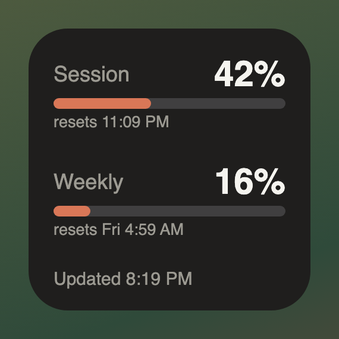
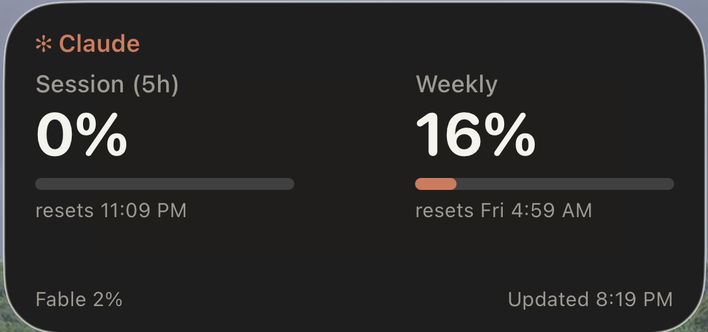
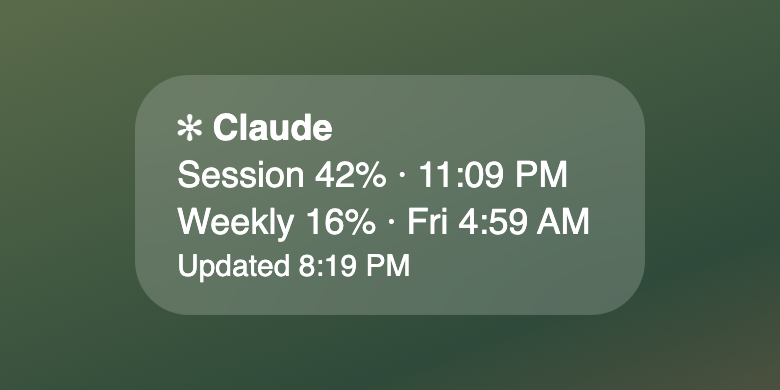

# Claude Usage Widget

An iOS [Scriptable](https://scriptable.app) widget that shows your Claude session (5h) and weekly usage limits on your home or lock screen.

## Screenshots
| Small | Medium | Lock screen |
| --- | --- | --- |
|  |  |  |

*Medium is a real screenshot; small and lock screen are renders of the same layout.*

## How it works
- A SwiftBar plugin on your Mac (`~/.swiftbar/claude-usage.5m.sh`) writes `claude-usage.json` to `iCloud Drive/Claude Usage` every 5 minutes.
- The widget reads that file via iCloud and renders usage bars, reset times, and per-model weekly limits.

## Setup
1. Install Scriptable on your iPhone and add `Claude Usage.js` as a script.
2. In Scriptable: Settings → File Bookmarks → + → Pick Folder → `iCloud Drive/Claude Usage`. Name it `Claude Usage`.
3. Add a Scriptable widget to your home or lock screen and choose the script.

## Features
- Small, medium, and lock-screen (inline, circular, rectangular) sizes
- Bars turn amber at 70% and red at 90%
- Remembers the last reading on-device, so it never goes blank if iCloud or the Mac is offline
- Static "Updated 3:45 PM" label, with an amber warning if data is over 30 minutes old
- Shows 0% once a reset time has passed, until fresh data arrives
- Tap to open claude.ai usage settings
